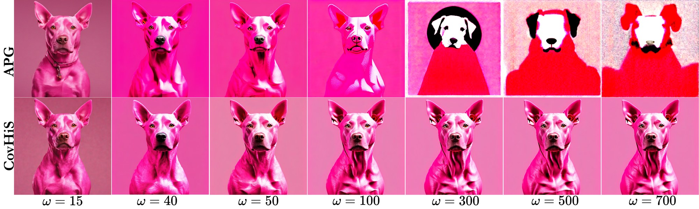

<div align="center">

# CovHiS: Bridging Covariance and Subspace History for Classifier-Free Guidance

**ACCV 2026**

[Nazmus Saqib](https://orcid.org/0000-0002-0102-5627)<sup>1</sup>, Masud-An Nur Islam Fahim<sup>2</sup>, Gyongmin Kim<sup>1</sup>, Joon-Min Gil<sup>1</sup>
<br>
<sup>1</sup>Jeju National University, Jeju, Republic of Korea &nbsp;&nbsp; <sup>2</sup>University of Vaasa, Vaasa, Finland

[](#)
[](#)
[](#)
[](LICENSE)



<em>CovHiS stays consistent far beyond the usual guidance range. Prompt: "A pink dog", SDXL, same NFEs. APG (top) collapses as ω grows; CovHiS (bottom) remains stable up to ω = 700.</em>

</div>

---

## 📰 News

- **[2026-09-28]** Code released.
- **[2026-09-25]** CovHiS is accepted to **ACCV 2026**! 🎉

## 📖 Overview

The classifier-free guidance (CFG) scale is critical to sample quality in diffusion models. Raising it sharpens prompt adherence but introduces over-saturation, contrast blow-up, and burnout; lowering it loses crisp detail. Existing training-free fixes (APG, HiGS, TAG, …) still scale their corrected residual linearly with ω, so the failure is postponed rather than removed.

**CovHiS** is a **training-free, plug-and-play** CFG correction that decouples high-guidance stabilization from prompt-detail recovery:

1. **History-Orthogonal Residual Filtering (HoRF).** A short buffer of recent CFG residuals reveals a low-rank *recurrent* subspace — the directions that CFG keeps reinforcing step after step and that drive saturation. CovHiS attenuates the residual component inside this subspace, then applies an **adaptive guidance budget** so the effective guidance displacement is bounded instead of growing with ω.
2. **Covariance-Tangent Detail Refinement.** The conditional covariance of the text-conditioned prediction exposes prompt-relevant eigen-directions. CovHiS reweights them, extracts the detail they reveal, and injects **only its tangential component** under a relative norm budget, restoring structure without reintroducing saturation.

CovHiS works across backbones (SD 2.1, SDXL, SD3, SD3.5, DiT-XL/2, SiT-XL+REPA), samplers (DDIM, DPM++, SDE-DPM++, PNDM, UniPC), and modalities (text-to-image, class-conditional, text-to-video with Mochi).

## 🔧 Method

Let $\hat\epsilon_c$ and $\hat\epsilon_\varnothing$ be the conditional and unconditional predictions and $d_t = \hat\epsilon_c - \hat\epsilon_\varnothing$ the CFG residual. At each denoising step:

**Stage 1 — Saturation stabilization (HoRF-CFG)**

| Step | Operation |
|---|---|
| Momentum residual | $m_t = d_t + \beta\, m_{t-1}$, with $-1 < \beta < 0$ |
| History subspace | Stack the last $k_t = \min(W, t-1)$ residuals into $H_t$, take SVD, keep top-$r$ right singular vectors $Q_t$ |
| Orthogonal filtering | $s_t = (I - Q_tQ_t^\top)\,m_t + \eta\, Q_tQ_t^\top m_t$, with $0 \le \eta \le 1$ |
| Adaptive budget | $q_t = \dfrac{\lVert \omega s_t \rVert}{\lVert \hat\epsilon_c \rVert + \delta}$, $\;q_t^\star = \min(\sqrt{\gamma q_t}, \gamma)$, $\;\alpha_t = \dfrac{q_t^\star}{q_t + \delta}$ |
| HoRF update | $P_t = \hat\epsilon_\varnothing + \omega\, \alpha_t\, s_t$ |

**Stage 2 — Covariance-tangent detail refinement**

| Step | Operation |
|---|---|
| Unconditional momentum | $\hat P_t = P_t + \mathcal{M}(\hat\epsilon_\varnothing;\, \beta_1)$ |
| Conditional covariance | $\psi_t = \Phi_t \Lambda_t \Phi_t^\top$ (covariance of $\hat\epsilon_c$) |
| Eigen reweighting | $\bar\Lambda_t = I + \kappa \left(\dfrac{\Lambda_t}{\lambda_{\max} + \delta}\right)^{p}$ |
| Covariance detail | $d_t^{\text{cov}} = (\Phi_t \bar\Lambda_t \Phi_t^\top - I)\, d_t$ |
| Tangential part | $d_t^{\text{tan}} = d_t^{\text{cov}} - \dfrac{\langle d_t^{\text{cov}}, \hat\epsilon_\varnothing\rangle}{\lVert\hat\epsilon_\varnothing\rVert^2 + \delta}\,\hat\epsilon_\varnothing$ |
| Norm budget | $\rho_t = \min\!\left(\dfrac{\mu \lVert \hat P_t \rVert}{\lVert d_t^{\text{tan}} \rVert + \delta},\, 1\right)$ |
| **Final prediction** | $\hat\epsilon_{\text{CovHiS}} = \hat P_t + \rho_t\, d_t^{\text{tan}}$ |

Defaults from the paper: $\kappa = 1$, $p = 2$. See the paper for the remaining hyperparameters and ablations on $\beta_1$, $p$, and $\eta$.

## 🛠️ Installation

```bash
git clone https://github.com/<user>/CovHiS.git
cd CovHiS

conda create -n covhis python=3.10 -y
conda activate covhis
pip install -r requirements.txt
```

## 🚀 Quick Start

<!-- TODO: replace with the actual entry point / API of this repository -->

```bash
python sample.py \
    --model sdxl \
    --prompt "A pink dog" \
    --guidance_scale 30.5 \
    --sampler ddim \
    --steps 50 \
    --seed 0 \
    --output outputs/
```

### Supported models and samplers

| Task | Models |
|---|---|
| Text-to-image | Stable Diffusion 2.1, SDXL, SD3, SD3.5 Large |
| Class-conditional (ImageNet) | DiT-XL/2, SiT-XL + REPA |
| Text-to-video | Mochi |

Samplers: DDIM, DPM++, SDE-DPM++, PNDM, UniPC.

## 📊 Evaluation

<!-- TODO: add evaluation scripts / commands -->

We evaluate text-to-image generation on 30K MS-COCO validation captions (FID, Precision, Recall, Saturation, Contrast), human preference on DrawBench, PartiPrompts, and HPS prompts (ImageReward, HPSv2, win rate), and video generation on 100 VBench prompts.

## 📈 Results

**Scale-aware guidance comparison**

| Model | Method | FID ↓ | Precision ↑ | Recall ↑ | Saturation ↓ | Contrast ↓ |
|---|---|---|---|---|---|---|
| SiT-XL + REPA (ω = 7.5) | CFG | 12.17 | 0.62 | 0.76 | 0.32 | 0.28 |
| | APG | 6.72 | 0.42 | 0.74 | 0.30 | 0.21 |
| | HiGS | 4.82 | 0.79 | 0.71 | 0.32 | 0.20 |
| | **CovHiS** | **4.37** | **0.94** | **0.76** | **0.24** | **0.16** |
| DiT-XL/2 (ω = 4.5) | CFG | 8.81 | 0.73 | 0.67 | 0.36 | 0.25 |
| | APG | 8.03 | 0.74 | 0.71 | 0.30 | 0.20 |
| | HiGS | 7.11 | 0.74 | 0.72 | 0.32 | 0.16 |
| | **CovHiS** | **6.98** | **0.81** | **0.74** | **0.28** | **0.14** |
| SD 2.1 (ω = 10) | CFG | 27.53 | 0.65 | 0.41 | 0.36 | 0.27 |
| | APG | 24.28 | 0.68 | 0.42 | 0.27 | 0.22 |
| | HiGS | 22.29 | 0.67 | 0.43 | 0.28 | 0.21 |
| | **CovHiS** | **20.29** | **0.71** | **0.47** | **0.22** | **0.18** |
| SDXL (ω = 15) | CFG | 28.48 | 0.57 | 0.49 | 0.35 | 0.25 |
| | APG | **26.85** | 0.58 | 0.55 | 0.27 | 0.13 |
| | HiGS | 26.92 | 0.59 | 0.57 | 0.23 | 0.16 |
| | **CovHiS** | 27.28 | **0.61** | **0.60** | **0.12** | **0.12** |
| SD 3 (ω = 7.5) | CFG | 27.19 | 0.72 | 0.41 | 0.34 | 0.27 |
| | APG | 27.02 | 0.74 | 0.43 | 0.32 | 0.22 |
| | HiGS | 26.83 | 0.76 | 0.42 | 0.33 | 0.23 |
| | **CovHiS** | **26.51** | **0.82** | **0.48** | **0.27** | **0.18** |

**Sampler robustness (ω = 17.5)** — averaged over five samplers, CovHiS raises CLIP score from 0.62 (APG) to 0.70 while cutting saturation from 0.32 to 0.18.

| Sampler | CovHiS FID / CLIP / Sat. | APG FID / CLIP / Sat. | CFG FID / CLIP / Sat. |
|---|---|---|---|
| DDIM | **6.17** / **0.74** / **0.16** | 6.69 / 0.62 / 0.30 | 17.45 / 0.38 / 0.42 |
| DPM++ | **6.19** / **0.74** / **0.18** | 6.87 / 0.62 / 0.32 | 17.65 / 0.38 / 0.43 |
| SDE-DPM++ | 8.58 / **0.61** / **0.18** | **8.53** / 0.57 / 0.32 | 19.01 / 0.36 / 0.43 |
| PNDM | 5.44 / **0.68** / **0.18** | **5.37** / **0.68** / 0.32 | 16.50 / 0.40 / 0.43 |
| UniPC | **6.13** / **0.72** / **0.18** | 6.91 / 0.62 / 0.32 | 17.65 / 0.38 / 0.43 |

**Human preference (HPSv2)**

| Benchmark | SDXL: CFG / +HiGS / **+CovHiS** | SD3: CFG / +HiGS / **+CovHiS** | SD3.5: CFG / +HiGS / **+CovHiS** |
|---|---|---|---|
| DrawBench | 0.224 / 0.249 / **0.286** | 0.257 / 0.272 / **0.311** | 0.258 / 0.270 / **0.311** |
| PartiPrompts | 0.239 / 0.261 / **0.289** | 0.273 / 0.285 / **0.365** | 0.270 / 0.282 / **0.352** |
| HPS Prompts | 0.245 / 0.275 / **0.283** | 0.279 / 0.291 / **0.334** | 0.274 / 0.289 / **0.377** |

See the paper for ImageReward, win rates, VBench video results, and component ablations.

## 📝 Citation

If you find CovHiS useful in your research, please consider citing:

```bibtex
@inproceedings{saqib2026covhis,
  title     = {CovHiS: Bridging Covariance and Subspace History for Classifier-Free Guidance},
  author    = {Saqib, Nazmus and Fahim, Masud-An Nur Islam and Kim, Gyongmin and Gil, Joon-Min},
  booktitle = {Proceedings of the Asian Conference on Computer Vision (ACCV)},
  year      = {2026}
}
```

## 🙏 Acknowledgements

This work builds on ideas from [APG](https://arxiv.org/abs/2410.02416), [HiGS](https://arxiv.org/abs/2509.22300), and [TAG](https://arxiv.org/abs/2510.04533), and uses [🤗 Diffusers](https://github.com/huggingface/diffusers). We thank the authors for releasing their work.

## 📬 Contact

For questions, please open an issue or contact Nazmus Saqib (nsaqib1995@gmail.com).

## 📄 License

This project is released under the [MIT License](LICENSE).
